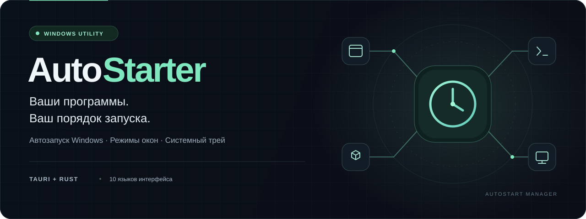
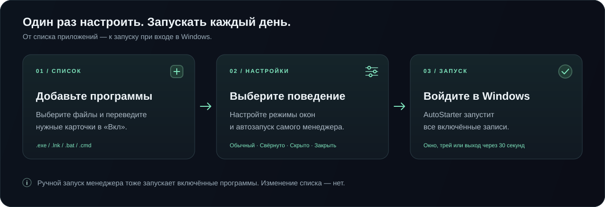

# AutoStarter

<!-- language-switcher -->
[English](../README.md) · [Русский](README.ru.md) · [中文](README.zh.md) · [Español](README.es.md) · [العربية](README.ar.md) · [Português](README.pt.md) · **Français** · [Deutsch](README.de.md) · [日本語](README.ja.md) · [हिन्दी](README.hi.md)



**Gestionnaire de démarrage de programmes pour Windows avec réglage du comportement des fenêtres et prise en charge de la zone de notification.**

AutoStarter (AutoStart Manager dans l'interface) lance les applications sélectionnées lors de son propre démarrage. Ajoutez les programmes dont vous avez besoin, configurez leur comportement et activez le démarrage automatique du gestionnaire lui-même — votre ensemble d'applications se lancera alors à l'ouverture de session Windows.

Le projet est construit avec **Tauri 1, Rust, TypeScript et Vite 5**.

> **Windows uniquement.** L'application utilise le registre et l'API Win32 ; l'exécution et la compilation de la version bureau sous Linux et macOS ne sont pas prises en charge dans l'implémentation actuelle.

## Sommaire

- [Fonctionnalités](#fonctionnalités)
- [Démarrage rapide](#démarrage-rapide)
- [Modes de lancement des programmes](#modes-de-lancement-des-programmes)
- [Paramètres du gestionnaire](#paramètres-du-gestionnaire)
- [Installation et compilation depuis les sources](#installation-et-compilation-depuis-les-sources)
- [Stockage des données et démarrage automatique de Windows](#stockage-des-données-et-démarrage-automatique-de-windows)
- [Questions fréquentes](#questions-fréquentes)
- [Structure du projet](#structure-du-projet)
- [Contribuer](#contribuer)
- [Licence](#licence)

## Fonctionnalités

- **Votre propre liste de programmes :** ajoutez des fichiers `.exe`, des raccourcis `.lnk` et des scripts `.bat` / `.cmd` via la boîte de dialogue de sélection de fichiers.
- **Activation indépendante :** excluez temporairement un programme du démarrage sans le supprimer de la liste.
- **Contrôle des fenêtres :** lancement normal, réduit ou masqué, ainsi que l'envoi d'une commande de fermeture après détection du processus.
- **Lancement à l'ouverture de session Windows :** démarrage automatique du gestionnaire pour l'utilisateur actuel.
- **Prise en charge de la zone de notification :** masquer la fenêtre principale, la restaurer et quitter via le menu contextuel de l'icône.
- **Mode sans interface :** lance les programmes activés et ferme le gestionnaire au bout de 30 secondes.
- **Paramètres locaux :** la liste des programmes et les options sont enregistrées dans des fichiers JSON.
- **10 langues d'interface :** russe, anglais, chinois, espagnol, arabe, portugais, français, allemand, japonais et hindi.

## Démarrage rapide



Si l'application n'est pas encore compilée, suivez d'abord les [instructions de compilation](#installation-et-compilation-depuis-les-sources).

1. Lancez `tauri-app.exe` — c'est le nom actuel de l'exécutable du projet.
2. Ouvrez les paramètres avec le bouton en bas à droite et choisissez **Language → Français**.
3. Cliquez sur **« + Ajouter »** et sélectionnez un programme ou un script.
4. Si nécessaire, cochez **« Réduit »**, **« Masqué »** ou **« Fermer »** sur la carte du programme.
5. Placez le commutateur de la carte sur **« On »**. Les nouvelles entrées sont désactivées par défaut.
6. Dans les paramètres, activez **« Démarrage automatique »** si vous souhaitez lancer le gestionnaire avec les programmes sélectionnés à l'ouverture de session Windows.

Les modifications sont enregistrées automatiquement. Le bouton de suppression retire uniquement l'entrée de la liste — le fichier du programme reste sur le disque.

> **Important :** les programmes activés sont lancés à chaque nouveau démarrage du processus AutoStarter, y compris manuel. Ajouter une entrée ou la passer sur « On » ne la lance pas immédiatement. Pour vérifier votre configuration, quittez complètement le gestionnaire via **Quit** dans la zone de notification, puis rouvrez-le. Les applications déjà en cours d'exécution peuvent être relancées.

## Modes de lancement des programmes

| Mode sur la carte | Comportement |
| --- | --- |
| Sans option supplémentaire | Lancement normal via `cmd /c start`. |
| **Réduit** | Lancement via `cmd /c start /min`, avec demande d'une fenêtre réduite. |
| **Masqué** | Lancement via PowerShell `Start-Process -WindowStyle Hidden`. Il s'agit d'une demande de masquer la fenêtre, et non d'une garantie que le programme apparaîtra dans la zone de notification. |
| **Fermer** | Lancement normal, puis recherche du processus par nom de fichier pendant environ 30 secondes. Une fois détecté, le gestionnaire attend encore 0,5 seconde et envoie la commande système de fermeture aux fenêtres visibles du processus. |
| **Off / On** | Exclut ou inclut l'entrée dans le lancement lors du prochain démarrage du gestionnaire. |

**Particularités et limites :**

- « Réduit » et « Masqué » s'excluent mutuellement dans l'interface.
- « Fermer » est prioritaire sur ces deux modes et ne signifie pas l'arrêt forcé du processus. L'application cible peut se fermer, se réduire dans sa propre zone de notification, afficher une boîte de dialogue ou ignorer la demande.
- La recherche pour « Fermer » s'effectue par nom de fichier, et non par chemin complet ou identifiant de l'instance lancée. La commande peut donc toucher un processus déjà en cours portant le même nom. Pour les raccourcis et les scripts, le nom du fichier sélectionné ne correspond généralement pas au nom réel du processus.
- Certaines applications gèrent elles-mêmes leurs fenêtres et peuvent ignorer un lancement masqué ou réduit.
- L'interface ne permet pas de configurer les arguments de ligne de commande, le répertoire de travail ni des délais individuels.

N'ajoutez que des programmes et des scripts de confiance. N'utilisez pas « Fermer » pour des applications comportant des données non enregistrées sans l'avoir testé au préalable.

## Paramètres du gestionnaire

| Paramètre | Rôle |
| --- | --- |
| **Langue** | Change la langue de l'interface ; l'anglais est sélectionné par défaut. |
| **Démarrer dans la zone de notification** | Masque la fenêtre principale au lancement de la version normale et affiche une icône dans la zone de notification. |
| **Démarrage automatique** | Ajoute AutoStarter au démarrage automatique de Windows pour l'utilisateur actuel. Désactivé par défaut. |
| **Fermer après exécution** | Au démarrage automatique de Windows, ajoute l'option `--close-after-30` : le gestionnaire lance les programmes activés, attend 30 secondes et se termine sans créer d'interface ni d'icône. Disponible uniquement si « Démarrage automatique » est activé. |

**« Fermer » sur une carte et « Fermer après exécution » dans les paramètres sont deux fonctions différentes :** la première concerne les fenêtres du programme sélectionné, la seconde le gestionnaire lui-même. L'intervalle de 30 secondes est fixe et ne signifie pas attendre la fin de toutes les applications lancées.

Un lancement manuel normal sans l'option ouvre le gestionnaire selon le paramètre « Démarrer dans la zone de notification », même si « Fermer après exécution » est activé.

### Contrôle via la zone de notification

- **La croix de la fenêtre** masque le gestionnaire dans la zone de notification au lieu de le fermer.
- **Un clic sur l'icône** ou l'élément **Show** ramène la fenêtre principale.
- **Clic droit → Quit** ferme complètement le gestionnaire.

Les noms des éléments du menu de la zone de notification s'affichent actuellement en anglais, quelle que soit la langue de l'interface.

## Installation et compilation depuis les sources

### Prérequis

La version graphique nécessite le **Microsoft Edge WebView2 Runtime**. Un environnement de compilation pratique est Windows 10/11 avec les éléments suivants installés :

- [Node.js](https://nodejs.org/) **20 ou plus récent** et npm ; la version LTS actuelle est recommandée.
- [Rust](https://rustup.rs/) — chaîne d'outils stable actuelle pour Windows MSVC. Le `Cargo.toml` indique un minimum de 1.70, mais les dépendances du fichier lock peuvent exiger une version plus récente.
- [Visual Studio Build Tools](https://visualstudio.microsoft.com/visual-cpp-build-tools/) avec les composants **Desktop development with C++**, MSVC et le SDK Windows.
- [Microsoft Edge WebView2 Runtime](https://developer.microsoft.com/en-us/microsoft-edge/webview2/).
- [Git](https://git-scm.com/) pour cloner le dépôt.

Informations complémentaires : [préparation de l'environnement Tauri 1 pour Windows](https://v1.tauri.app/v1/guides/getting-started/prerequisites/#setting-up-windows).

### Récupération des sources

Dans PowerShell, exécutez :

```powershell
git clone https://github.com/BORGERone/AutoStarter.git
cd AutoStarter
npm ci
```

`npm ci` installe les dépendances d'après `package-lock.json`. La première compilation nécessite également un accès réseau pour télécharger les dépendances Rust et les outils d'empaquetage.

### Mode développement

```powershell
npm run tauri-dev
```

Ou lancez `dev.bat` depuis l'Explorateur. Tauri démarre automatiquement Vite sur le port **5174** et ouvre la fenêtre bureau.

> `npm run dev` ne démarre que l'interface web. Dans un navigateur ordinaire, les fonctions Tauri ne sont pas disponibles : sélection de fichiers via la boîte de dialogue native, enregistrement des paramètres, contrôle de la zone de notification et du registre. Utilisez `npm run tauri-dev` pour une vérification complète de l'application.

### Compilation avec installateurs

```powershell
npm run tauri-build
```

La commande compile l'interface, l'application Rust et les paquets définis par la configuration Tauri. Les résultats se trouvent dans :

- `src-tauri/target/release/tauri-app.exe` — l'exécutable ;
- `src-tauri/target/release/bundle/` — les paquets d'installation créés par l'outil d'empaquetage.

### Compilation sans installateur

```powershell
.\build.bat
```

Le script exécute successivement `npm run build` puis `cargo build --release` dans le répertoire `src-tauri`. Le résultat est `src-tauri/target/release/tauri-app.exe`. L'interface graphique nécessite toujours le WebView2 Runtime.

Lancement manuel du mode sans interface :

```powershell
.\src-tauri\target\release\tauri-app.exe --close-after-30
```

### Vérification de l'interface

```powershell
npm run build
```

La commande effectue la vérification TypeScript et la compilation de production de Vite. Elle ne vérifie ni le code Rust ni le comportement de l'API Win32. Il n'existe pour l'instant pas de script de tests automatisés distinct dans `package.json`.

## Stockage des données et démarrage automatique de Windows

Les paramètres de l'utilisateur actuel sont stockés dans le répertoire :

```text
%APPDATA%\tauri-launcher\
├── programs.json    # Liste des programmes, chemins et modes de lancement
└── settings.json    # Langue et paramètres du gestionnaire
```

Pour une sauvegarde, quittez complètement le gestionnaire et copiez les deux fichiers. Lors d'un transfert vers un autre ordinateur, vérifiez les chemins des programmes. Les paramètres de démarrage automatique dans le registre ne font pas partie de cette copie : après le transfert, réactivez le démarrage automatique depuis l'instance souhaitée de l'application.

L'activation du « Démarrage automatique » crée la valeur **`AutoStartManager`** dans la clé :

```text
HKEY_CURRENT_USER\Software\Microsoft\Windows\CurrentVersion\Run
```

Elle contient le chemin de l'exécutable actuel du gestionnaire et, le cas échéant, l'option `--close-after-30`. Il s'agit d'un lancement **à l'ouverture de session de l'utilisateur actuel**, et non d'un service système. Aucune entrée distincte n'est créée pour chaque programme ajouté ; le gestionnaire ne gère pas le démarrage automatique existant des autres applications.

**Désactivez le « Démarrage automatique » avant de déplacer ou de supprimer l'exécutable.** Après l'avoir déplacé, ouvrez le gestionnaire depuis son nouvel emplacement et réactivez l'option. Pour une réinitialisation complète, désactivez d'abord le démarrage automatique, quittez l'application via Quit, puis supprimez le répertoire `%APPDATA%\tauri-launcher` — cela supprimera la liste enregistrée et les paramètres.

## Questions fréquentes

**Un programme a été ajouté, mais il ne se lance pas.**

Vérifiez le commutateur « On » sur sa carte et l'existence du fichier au chemin indiqué. Redémarrez complètement le gestionnaire : modifier la liste ne lance rien en soi. Pour un lancement à l'ouverture de session Windows, le « Démarrage automatique » doit aussi être activé dans les paramètres du gestionnaire.

**Les applications s'ouvrent deux fois.**

AutoStarter ne vérifie pas si un programme est déjà lancé. Vérifiez son propre paramètre de démarrage automatique et la liste de démarrage de Windows. Redémarrer le gestionnaire lui-même relance également toutes les entrées activées.

**Après avoir cliqué sur la croix, le gestionnaire fonctionne toujours.**

C'est le comportement attendu. Trouvez l'icône AutoStart Manager dans la zone de notification, déployez les icônes masquées si nécessaire, puis choisissez Quit.

**L'application n'apparaît pas après l'ouverture de session Windows.**

Vérifiez « Démarrer dans la zone de notification » et « Fermer après exécution » : dans le premier cas la fenêtre est masquée, dans le second aucune interface n'est créée. Pour modifier les paramètres, lancez l'exécutable manuellement sans l'option `--close-after-30`.

**La compilation ne trouve pas l'éditeur de liens ou le SDK Windows.**

Vérifiez l'installation des C++ Build Tools et de la chaîne d'outils MSVC de Rust, puis redémarrez le terminal. En cas de problème d'affichage de la fenêtre, vérifiez la présence du WebView2 Runtime.

**Le mode développement signale que le port est occupé.**

Libérez le port 5174, par exemple en fermant l'instance précédente de Vite. Ce port est utilisé à la fois dans la configuration de Vite et dans celle de Tauri.

## Structure du projet

```text
AutoStarter/
├── index.html                 # Balisage de la fenêtre principale et des paramètres
├── src/
│   ├── main.ts                # Interface, traductions et appels Tauri
│   └── styles.css             # Styles de l'application
├── src-tauri/
│   ├── src/main.rs            # Lancement des programmes, JSON, registre et zone Win32
│   ├── Cargo.toml             # Dépendances et paramètres Rust
│   ├── Cargo.lock             # Dépendances Rust figées
│   ├── build.rs               # Script de compilation Tauri
│   └── tauri.conf.json        # Fenêtre, autorisations et empaquetage
├── icon.ico                   # Icône de l'application et de la zone de notification
├── package.json               # Commandes npm et dépendances de l'interface
├── package-lock.json          # Dépendances npm figées
├── vite.config.ts             # Configuration de Vite
├── build.bat                  # Compilation release sans installateur
└── dev.bat                    # Lancement du mode développement
```

## Contribuer

Les rapports de bogues et les suggestions peuvent être déposés dans les [Issues](https://github.com/BORGERone/AutoStarter/issues). Pour un rapport reproductible, indiquez votre version de Windows, le mode de lancement ou de compilation, les étapes et le comportement attendu. Avant de publier des journaux ou des fichiers JSON, supprimez les données personnelles et les chemins privés.

Pour les modifications de l'interface, exécutez `npm run build` ; les changements liés au lancement, au registre et à la zone de notification doivent en outre être vérifiés dans la version bureau sous Windows. Il est préférable d'accompagner la pull request d'une description des modifications et des vérifications effectuées.

## Licence

Le fichier `src-tauri/Cargo.toml` indique la licence **MIT**. Un fichier `LICENSE` distinct contenant le texte complet de la licence n'est pas encore présent dans le dépôt.
